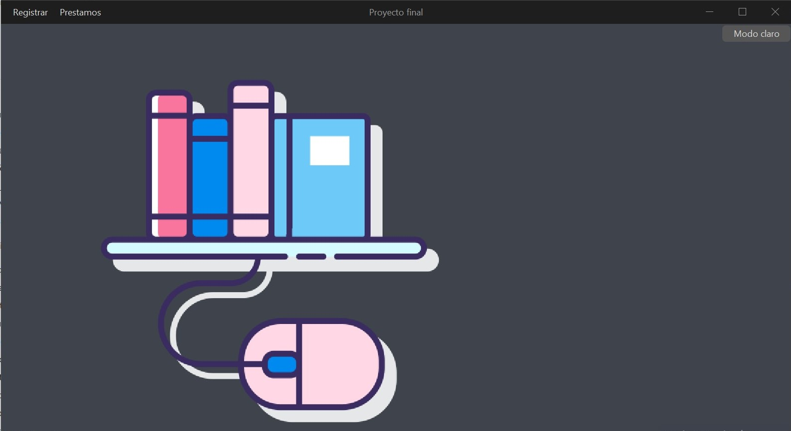
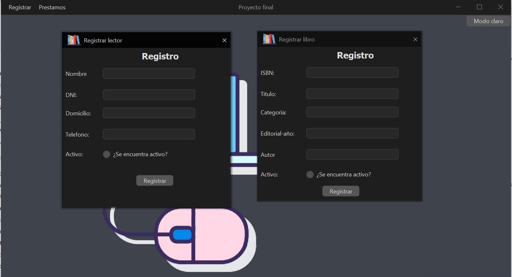

# ProyectoFinalArgentinaPrograma4.0
Proyecto final de argentina programa 4.0
# Pestaña principal del programa.
En esta pestaña podemos acceder a todas las opciones del programa.

# Pestañas de registro.
En estas pestañas podemos registrar libros, usuarios, prestamos y muchos otros tipos de datos en nuestra base de datos

